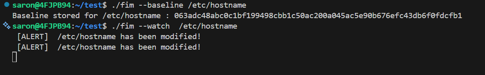

## Description
This is a file integrity monitor written in C for Linux. It hashes files using SHA-256, stores baseline fingerprints in a SQLite database and uses the Linux kernel's inotify API to detect real-time changes by comparing live hashes against the stored baseline.

## Features
- **Streaming SHA-256 hashing** — reads files in 4KB chunks, so memory usage stays constant regardless of file size
- **Zero-polling detection** — uses blocking I/O on inotify, meaning 0% CPU usage while idle (no busy-wait loops)
- **SQL injection-safe storage** — uses SQLite prepared statements for all database writes
- **Persistent baseline** — survives reboots since hashes are stored on disk, not in memory
- **CLI-driven** — single binary supports both `--baseline` and `--watch` modes

## How It Works
1. **Baseline mode (`--baseline`)** — the target file is read in 4KB chunks and hashed using SHA-256 (via OpenSSL's EVP API). The resulting hash is stored in a local SQLite database (`fim.db`), keyed by filepath.

2. **Watch mode (`--watch`)** — the program registers the target file with the Linux kernel's inotify subsystem. It then blocks on `read()`, consuming zero CPU until the kernel reports a modification event.

3. **Detection** — when a modification is detected, the file is rehashed and compared against the stored baseline using `strcmp()`. A mismatch triggers a tamper alert.

## Project Structure

```
fim/
├── main.c       # CLI entry point, baseline/watch logic
├── hasher.c     # SHA-256 file hashing (OpenSSL)
├── hasher.h
├── db.c         # SQLite storage and retrieval
├── db.h
├── watcher.c    # inotify-based file watching
├── watcher.h
├── Makefile
└── README.md
```

## Requirements
- Linux (uses inotify, not available on Windows/macOS)
- GCC
- libssl-dev (OpenSSL)
- libsqlite3-dev

## Demo
